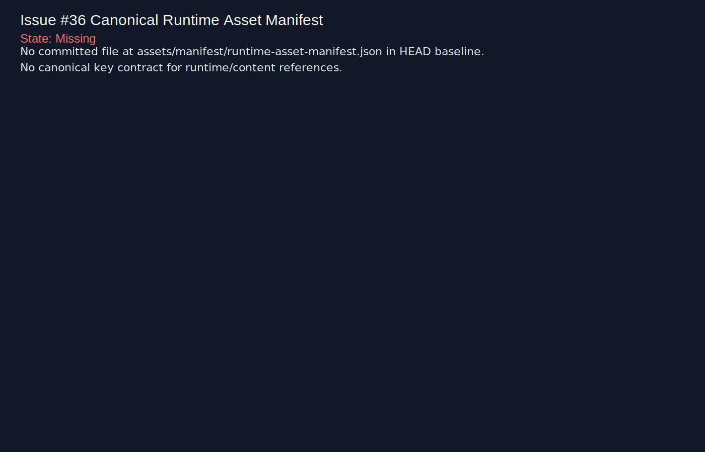
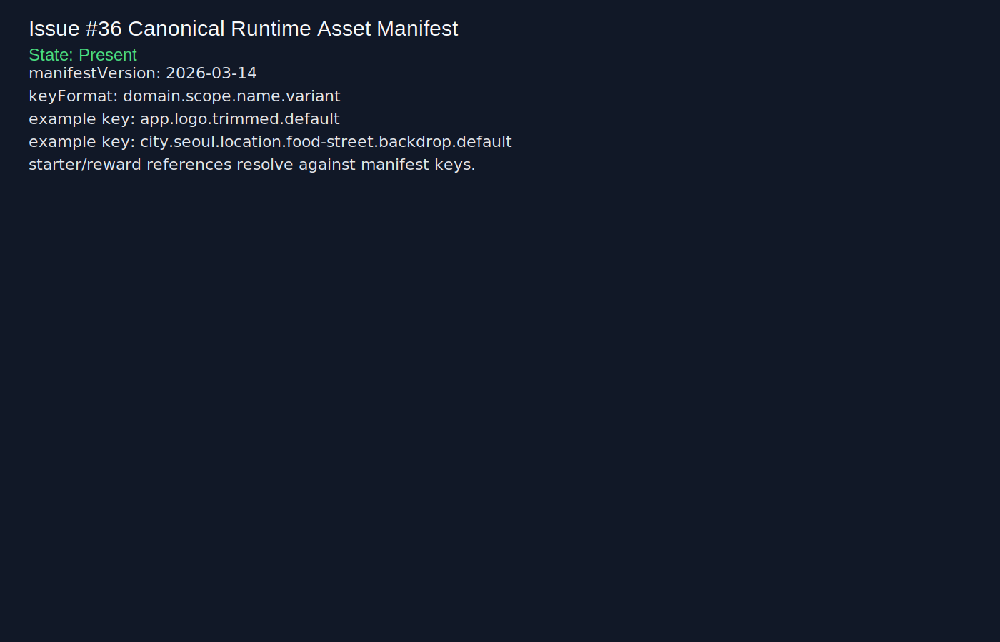
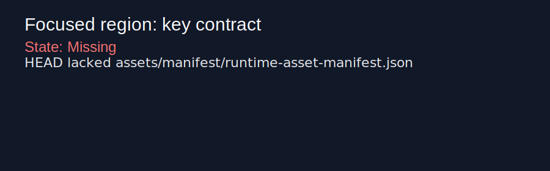
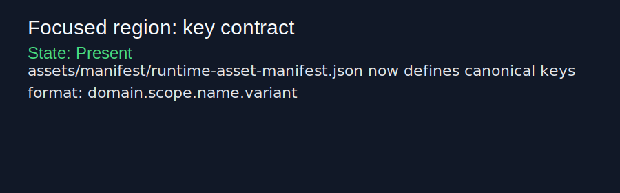

# Issue #36 reviewer proof

## Full-frame comparison (same state)

| Before | After |
| --- | --- |
|  |  |

## Focused comparison crop (changed key-contract region)

| Before | After |
| --- | --- |
|  |  |

Context: `after` reflects the canonical runtime manifest + stable key contract published in `assets/manifest/runtime-asset-manifest.json` and validated by smoke checks.
